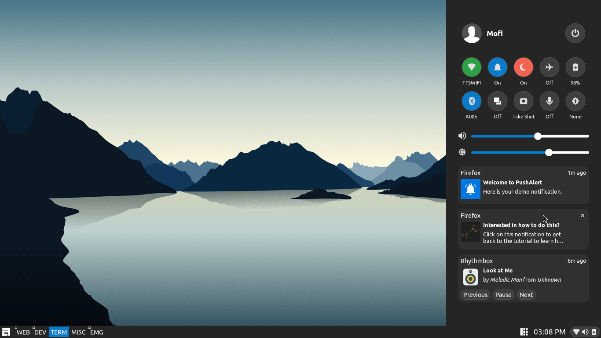
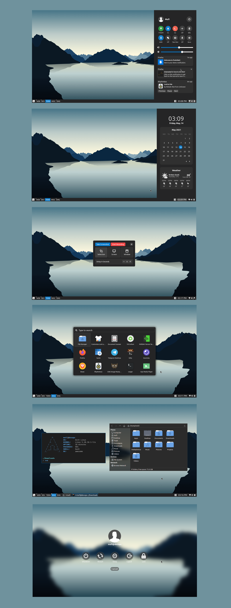

# AwesomeShell

This is a collection of [awesome wm](https://awesomewm.org/) configuration files



## Requirements
0. Any linux distribution. (Please change the software update notification as your package manager)
1. [awesomewm git version](https://awesomewm.org/)  window manager
2. [picom-git](https://github.com/yshui/picom)  compositor
3. [rofi > 1.6.0](https://github.com/davatorium/rofi)  application launcher
4. [Ubuntu font](https://archlinux.org/packages/community/any/ttf-ubuntu-font-family/)
5. [bluez-utils](https://archlinux.org/packages/extra/x86_64/bluez-utils/) (if you use bluetooth)
6. [maim](https://archlinux.org/packages/community/x86_64/scrot/) for screen shots
7. [iw](https://archlinux.org/packages/core/x86_64/iw/) for networks
8. [xidlehook](https://github.com/jD91mZM2/xidlehook) (for autometic lock and suspend)

## Installation
Clone the this repository 

```
https://github.com/Mofiqul/awesome-config.git
```
and move theme theme you like to `~/.config/` and rename to `awesome`

```
cd awesome-shell
git checkout dev-master  
mv dusky ~/.config/awesome
```

### Settings
Change your settings in `configurations/settings.lua`

### Startup programs
Add your startup program in  `module/autostart.lua`

> Note: If you are using dusky theme then add your cordinate and open weather map api key in `configurations/settings.lua`

```lua
settings.openweathermap_api_key = "<API KEY>"
settings.openweathermap_coordinates = {
	"<latitude>", -- lat
	"<longitude>" -- lng
}
```

I stole some of [The glorious dotfiles](https://github.com/manilarome/the-glorious-dotfiles) codes. 

**My other dotfiles (terminal, nvim, applications etc) is [Here](https://github.com/Mofiqul/Dotfiles)**

## Dusky Dark 


## Glassy


## Dusky light

