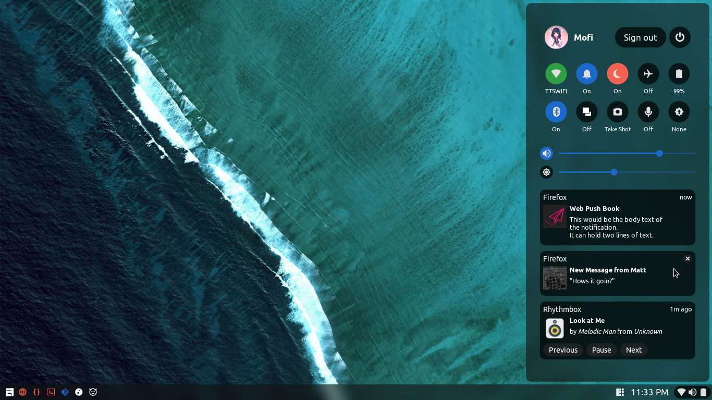
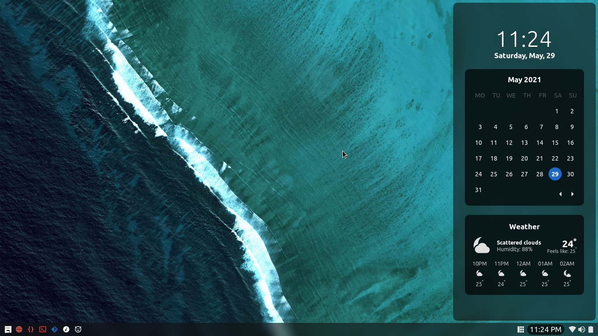
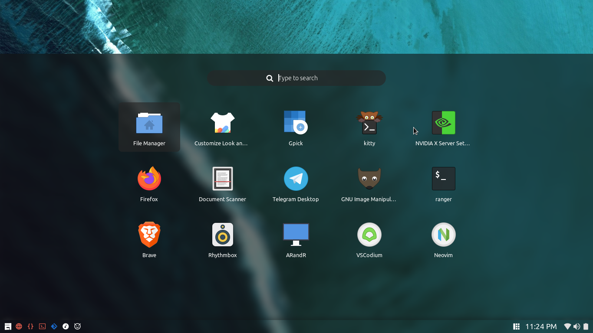
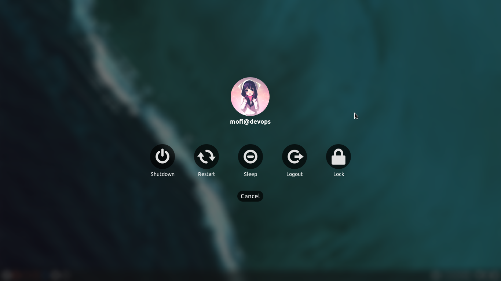
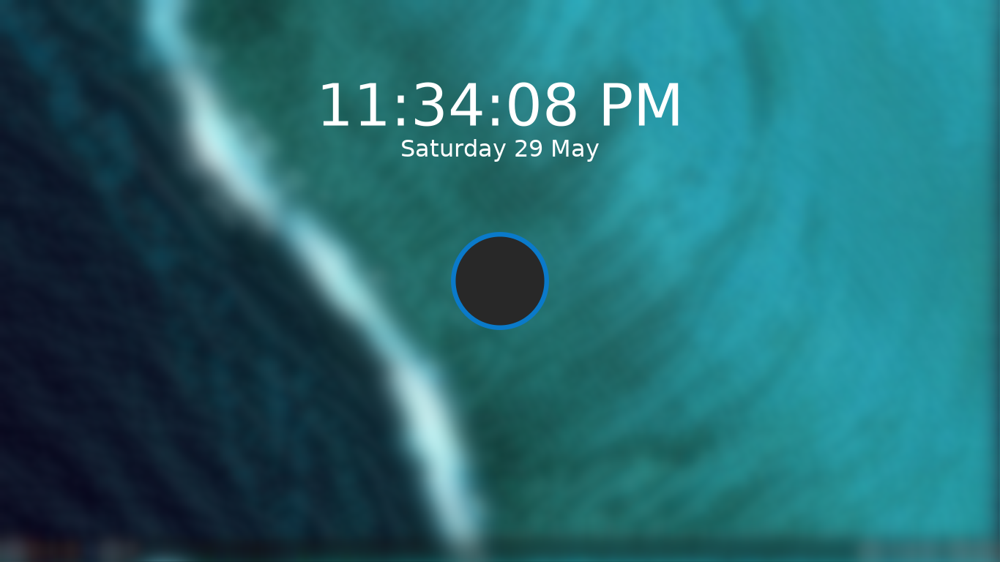
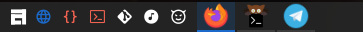
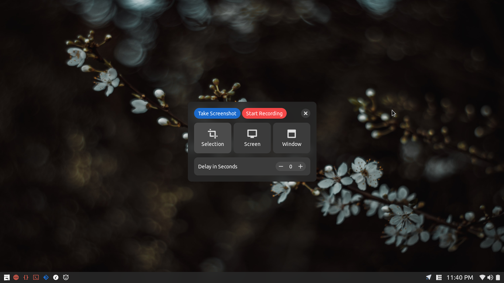
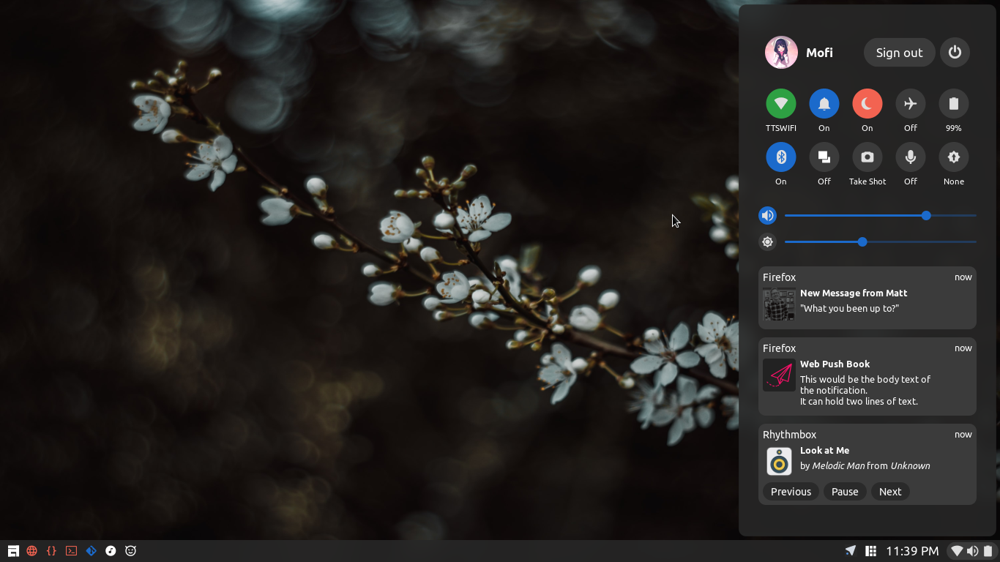
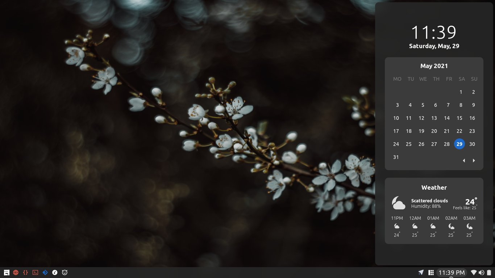
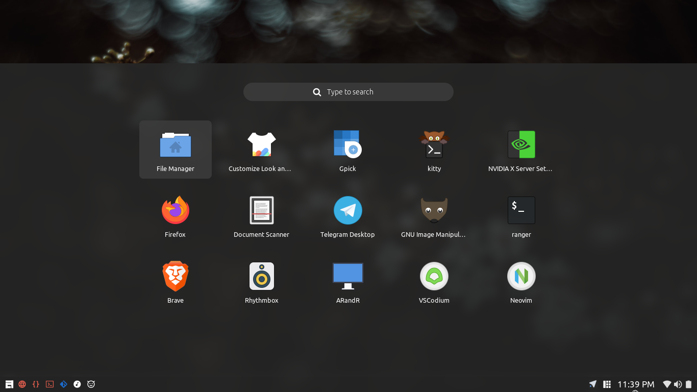

<h1 align="center"> ✨ AwesomeShell</h1>

This is a collection of [awesome wm](https://awesomewm.org/) configuration files



## ✔️ Requirements
0. Any linux distribution. (Please change the software update notification as your package manager)
1. [awesomewm git version](https://awesomewm.org/)  window manager
2. [picom-ibhagwan-git](https://github.com/ibhagwan/picom)  compositor
3. [rofi > 1.6.0](https://github.com/davatorium/rofi)  application launcher
4. [Ubuntu font](https://archlinux.org/packages/community/any/ttf-ubuntu-font-family/)
5. [Ubuntu Nerd Font](https://www.nerdfonts.com/font-downloads)
6. [bluez-utils](https://archlinux.org/packages/extra/x86_64/bluez-utils/) (if you use bluetooth)
7. [maim](https://archlinux.org/packages/community/x86_64/scrot/) for screen shots
8. ffmpeg
9. [iw](https://archlinux.org/packages/core/x86_64/iw/) for networks
10. [xidlehook](https://github.com/jD91mZM2/xidlehook) (for autometic lock and suspend)
11. [i3lock-fancy](https://github.com/meskarune/i3lock-fancy)
12. curl

## ⬇️ Installation
Clone the this repository 

```
git clone https://github.com/Mofiqul/awesome-shell.git  ~/.config/awesome
```

### ⚙️ Settings
Change your settings in `configurations/settings.lua`

```lua
settings.openweathermap_api_key = "<API KEY>"
settings.openweathermap_coordinates = {
	"<latitude>", -- lat
	"<longitude>" -- lng
}
```


### 🚀 Startup programs
Add your startup program in  `module/autostart.lua`

## 🦄 Changing theme 

Theme can changed to glassy or dark (see screen shot below)

Change in `theme.lua`
```lua
-- For glassy theme
theme.mode = "glassy"

-- For dark theme
theme.mode = "dark"
```

## 💕 Features
<h3 align="center">Control center and Notification center</h3>


<h3 align="center">Calendar and weather widget</h3>




<h3 align="center">App Launcher</h3>



<h3 align="center">Exit Screen</h3>



<h3 align="center">Lock Screen</h3>



<h3 align="center">Kde plasma style task manager</h3>


<h3 align="center">Icon only task manager</h3>



<h3 align="center">Screen shot and Recording tool(very basic)</h3>



### Other features
- Support for multi head
- Two theme


## 🌈 Dark theme 
> A less transpatent theme for better readability, My personal preference





**My other dotfiles (terminal, nvim, applications etc) is [Here](https://github.com/Mofiqul/Dotfiles)**

Thanks to [The glorious dotfiles](https://github.com/manilarome/the-glorious-dotfiles) for the inspirations