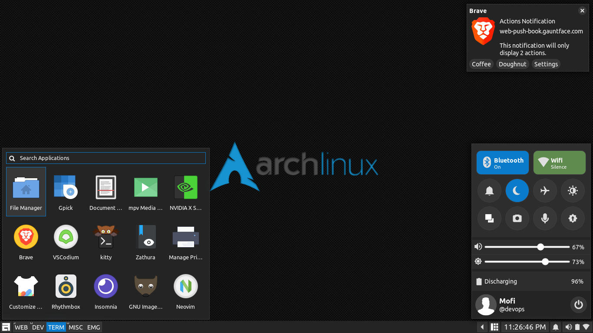
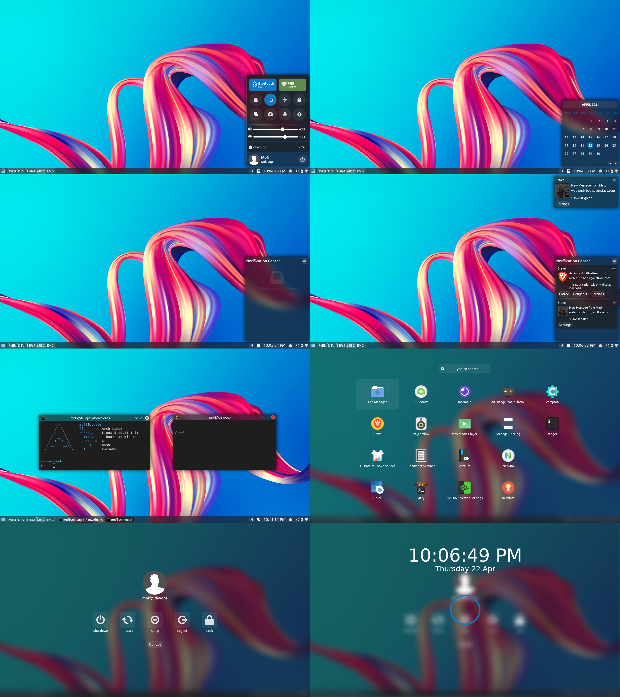
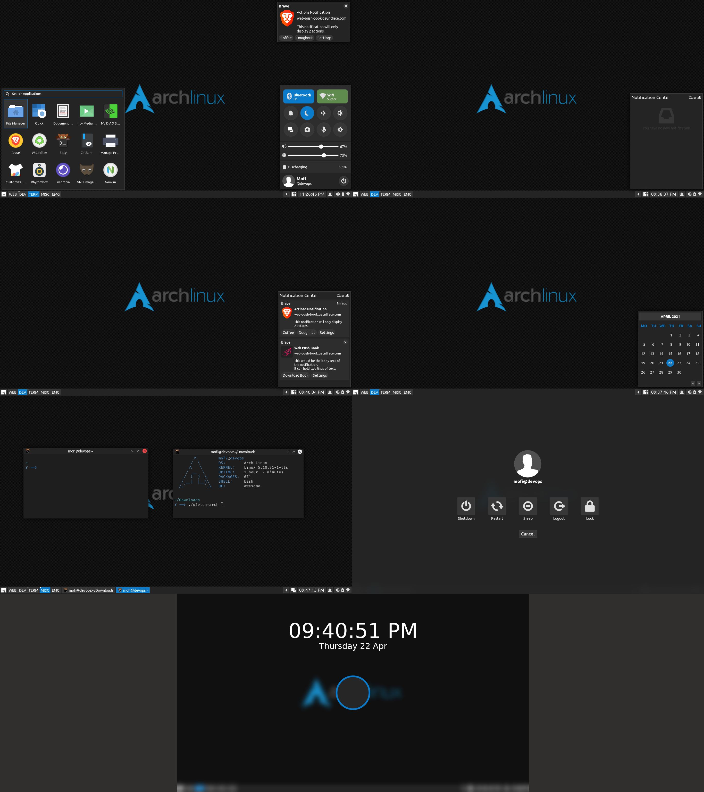
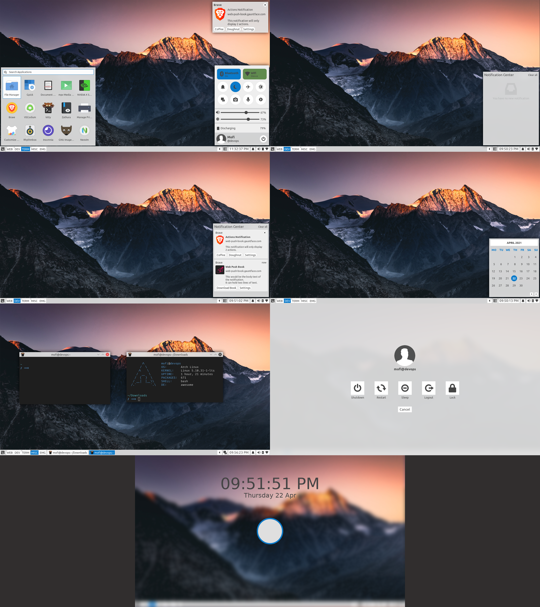

# AwesomeShell

This is a collection of [awesome wm](https://awesomewm.org/) configuration files



## Requirements
0. Any linux distribution. (Please change the soft update notifcation as you package manager)
1. [awesomewm git version](https://awesomewm.org/)  window manager
2. [picom-git](https://github.com/yshui/picom)  compositor
3. [rofi > 1.6.0](https://github.com/davatorium/rofi)  application launcher
4. [Ubuntu font](https://archlinux.org/packages/community/any/ttf-ubuntu-font-family/)
5. [bluez-utils](https://archlinux.org/packages/extra/x86_64/bluez-utils/) (if you use bluetooth)
6. [scrot](https://archlinux.org/packages/community/x86_64/scrot/) for screen shots
7. [iw](https://archlinux.org/packages/core/x86_64/iw/) for networks

## Installation
Clone the this repository
```https://github.com/Mofiqul/awesome-config.git```
And move the desired theme foder to `~/.config` and rename to `awesome`

I use symlink `ln -s ~/Projects/awesome-config/dusky ~/.config/awesome`

I stole some of [The glorious dotfiles](https://github.com/manilarome/the-glorious-dotfiles) codes. 

**My other dotfiles (terminal, nvim, applications etc) is [Here](https://github.com/Mofiqul/Dotfiles)**

## Glassy


## Dusky Dark 


## Dusky light

