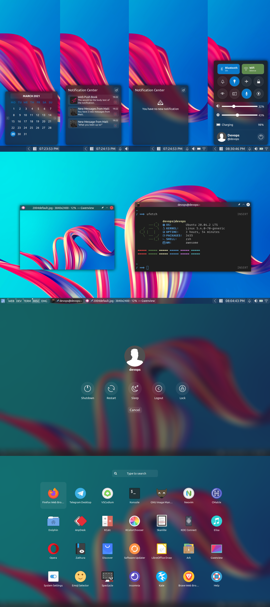

# awesome configurations

My [awesome wm](https://awesomewm.org/) configurations, maybe i will choose a name later :p

## Requirements
1. [awesomewm git version](https://awesomewm.org/)  window manager
2. [picom-git](https://github.com/yshui/picom)  compositor
3. [rofi > 1.6.0](https://github.com/davatorium/rofi)  application launcher
4. Ubuntu font

Took Inspiration from [The glorious dotfiles](https://github.com/manilarome/the-glorious-dotfiles) 

